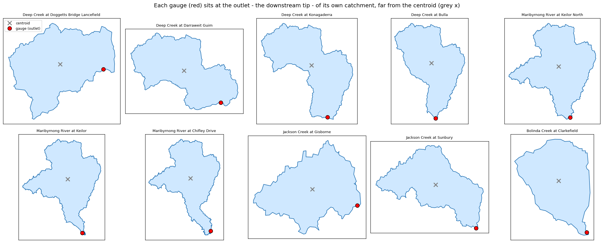

# Caravan-AUS-VIC: Maribyrnong River basin (10 gauges)

Caravan dataset extension for the Maribyrnong River catchment, north-west Melbourne, Victoria, Australia. Basin prefix: `ausvic`.

## What's in this bundle

- **10 gauges** spanning the Maribyrnong catchment: upper Deep Creek (Lancefield) down through Bulla and Keilor to Chifley Drive at the city fringe, plus Jacksons Creek (Gisborne → Sunbury) and Bolinda Creek at Clarkefield.
- **Daily streamflow** (mm/day) per gauge, area-normalised with the GEE Part-1 polygon areas.
- **Daily ERA5-Land forcings** (1950-01-02 → 2026-03-07): 14 ERA5-Land variables aggregated from hourly to daily (mean/min/max where applicable, plus a precipitation total and two potential-evaporation estimates).
- **Attributes**: 6-column `attributes_other`, the 197-column `attributes_hydroatlas`, 14 derived climate indices (`attributes_caravan`), and an extension-specific `attributes_additional` (basin name, streamflow period/missing/units, source, license, notes).
- **Single combined shapefile** `ausvic_basin_shapes.shp` (gauge_id only, EPSG:4326), 10 distinct simplified polygons.

Built with the official Caravan Part-1 (Earth Engine) and Part-2 (local postprocessing) notebooks.

## Gauge list

| gauge_id | name | km² | streamflow source | area cross-validated |
|----------|------|-----|-------------------|----------------------|
| ausvic_230119 | Deep Creek at Doggetts Bridge, Lancefield | 219.2 | BoM Water Data Online | MMBW 1986 |
| ausvic_230100 | Deep Creek at Darraweit Guim | 483.8 | BoM Water Data Online | Jacobs 2023 (500) |
| ausvic_230107 | Deep Creek at Konagaderra | 620.7 | BoM Water Data Online | MMBW 1986 |
| ausvic_230102 | Deep Creek at Bulla | 860.3 | BoM Water Data Online | MMBW 1986 (874), Jacobs 2023 (865) |
| ausvic_230237 | Maribyrnong River at Keilor North | 1,279.4 | BoM Water Data Online | MMBW 1986 |
| ausvic_230200 | Maribyrnong River at Keilor | 1,306.0 | Victorian Water (Hydstra) | MMBW 1986 (1,312), Jacobs 2023 (1,303) |
| ausvic_230106 | Maribyrnong River at Chifley Drive | 1,385.7 | BoM Water Data Online | MWSTR-at-Chifley (1,386) |
| ausvic_230206 | Jacksons Creek at Gisborne | 91.0 | Victorian Water (Hydstra) | MMBW 1986 |
| ausvic_230202 | Jacksons Creek at Sunbury | 342.8 | Victorian Water (Hydstra) | MMBW 1986 (338), Jacobs 2023 (337) |
| ausvic_230211 | Bolinda Creek at Clarkefield | 96.0 | BoM Water Data Online | MMBW 1986 (sub-catchment K) |

The MWSTR-derived catchment areas agree with two independent agency studies (MMBW 1986, Jacobs 2023) to within ~1.7% on the three primary gauges (Bulla, Keilor, Sunbury), and within ~3.2% across all cross-validated gauges.

## Catchment polygons

Polygons are derived from the Melbourne Water Stream Network (MWSTR) by tracing each gauge's upstream sub-catchments; they are distinct and properly nested (e.g. Konagaderra ⊂ Bulla ⊂ Keilor North ⊂ Keilor ⊂ Chifley Drive). Each gauge sits at the **outlet** — the downstream tip — of its own catchment, far from the centroid, confirming correct gauge-to-polygon placement:

## Streamflow sources

Seven Melbourne Water gauges (230100, 230102, 230106, 230107, 230119, 230211, 230237) are taken from **BoM Water Data Online** — the quality-controlled "Water Course Discharge" series (`DMQaQc.Merged.AsStored`), aggregated from sub-daily to a time-weighted daily mean. This replaces the earlier Melbourne Water API source and is cleaner and longer (Bulla reaches back to 1955), with the earlier API's spurious flood spikes removed. The three Victorian gauges — 230200 (Keilor), 230202 (Sunbury), 230206 (Gisborne) — come from the Victorian Water Measurement Information System (Hydstra) daily-discharge API (variable 141.00); the Keilor mainstem record is the longest in the set, beginning in 1950.

## Flood record

The two largest Maribyrnong floods are clearly resolved in the data. At Keilor (mainstem, record from 1950) the two biggest daily-mean peaks on record are **14 October 2022 (≈503 m³/s)** and **16 May 1974 (≈382 m³/s)**; the same first/second ordering holds at Bulla (record from 1955: Oct 2022 ≈317, May 1974 ≈295 m³/s). The October 2022 event is the flood of record at most gauges, is rain-driven (≈57 mm of ERA5-Land precipitation on 13 October, the day before the peak), and builds downstream along Deep Creek and the mainstem — Konagaderra ≈214 → Bulla ≈317 → Keilor ≈503 m³/s daily mean, with Chifley Drive ≈494 (slightly damped by tidal backwater). The May 1974 flood appears only at the four gauges whose records predate it (Keilor, Bulla, Sunbury, Gisborne).

## Caveats

- **230106 (Chifley Drive) is tidal.** BoM certifies a discharge rating only in the flood range — every reading above ~190 m³/s is quality-A (including the Oct-2022 peak) — and records the tidal baseflow as an uncertified ~0. It is therefore a reliable flood-event record with a low-confidence near-zero baseline. See `attributes_additional`.
- **230107 (Konagaderra)** is mixed BoM quality (~51% quality-A, ~34% quality-E); usable but lower-confidence than the mainstem Deep Creek gauges.
- **230202 (Sunbury)** has Hydstra data from 1908, but pre-1960 values are level-derived artefacts without a rating curve and are excluded (kept from 1960).
- **Negatives**: small near-zero negative sensor readings (sub-cumec) are clipped to 0 (Caravan requires non-negative streamflow). Missing values are `NaN`.
- **Period**: the merged timeseries runs 1950-01-02 → 2026-03-07, bounded by the ERA5-Land forcing export. Per-gauge streamflow periods are recorded in `attributes_additional`.

## Files

- `attributes/ausvic/` — `attributes_other_ausvic.csv` (6 cols), `attributes_hydroatlas_ausvic.csv` (197), `attributes_caravan_ausvic.csv` (14 climate indices), `attributes_additional_ausvic.csv` (extension-specific)
- `timeseries/csv/ausvic/` — `<gauge_id>.csv` (forcings + streamflow)
- `timeseries/netcdf/ausvic/` — `<gauge_id>.nc`
- `shapefiles/ausvic/` — `ausvic_basin_shapes.{shp,shx,dbf,prj,cpg}`
- `licenses/ausvic/` — `license_ausvic.md` (CC-BY-4.0 + sources + references)

## License & citation

Released under the Creative Commons Attribution 4.0 International (CC-BY-4.0) license.

> Lanzafame, L. (2026). *Caravan-AUS-VIC: Maribyrnong River basin (10 gauges).* Zenodo. https://doi.org/10.5281/zenodo.20580213
